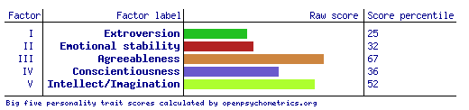

# Personality Clustering, Modelling and Analysis

Julian Benitez Mages & Anaelle Surprise

\

## Background & Context

The Big Five personality traits, known as the Five Factor Model, has emerged as one of the best models with which to measure and study personality. The model emerged from analyzing natural language used to describe individuals, and resulted in the following five key traits: Openness, Contientiousness, Extraversion, Agreeableness, and Neuroticism.

The International Personality Item Pool (IPIP) is among the most common and standardized resource for measuring one's scores of each trait of the Big Five. The self-report inventory involves answering a series of 50 questions, with ten serving to analyze each trait. Each question comes in the form of a personality characteristic, with the user asked to score their relatedness on a scale of one to five. The questions are divided roughly evenly between positive and negative correlation to the corresponding personality trait.

Our dataset contains 1,015,342 sets of answers to the IPIP inventory, collected between 2016 and 2018. Each row also contains the user's country, approximate latitude and longitude, screen size, and time spent answering each page of the website, including measures for each question.

## Our Objective

We would like to utilize machine learning to better understand groupings of personality. While the IPIP scores the survey results to provide raw scores and percentile indicators (first figure), these are simply calculated by adding up the values indicated with each answer for each trait.

We would like to use clustering techniques to better analyze the survey answers, and take advantage of the ancillary data to model for the respondents' countries, and derive associations between time spent answering the questions.
