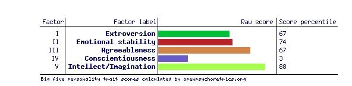

# Personality Clustering, Modeling, and Analysis

**Julian Benitez Mages & Anaelle Surprise**

\

\

## Data Setup

To set up your environment to run our model, follow these steps:

1. Clone the repository:
   ```
   git clone <repository_url>
   cd <repository_name>
   ```
2. Install dependencies:
   ```
   pip install -r requirements.txt
   ```
3. Run data_processing notebook:
   ```
   First cells download data locally
   Notebook puts data into format for EDA and ML
   ```

---
## Background & Context

The **Big Five Personality Traits**, or **Five Factor Model**, is one of the most widely accepted frameworks for studying personality. It emerged from analyzing natural language descriptions of people and consists of five key traits:
- **Openness**
- **Conscientiousness**
- **Extraversion**
- **Agreeableness**
- **Neuroticism**

The **International Personality Item Pool (IPIP)** is a widely used self-report inventory that measures these traits through a set of 50 questions. Each question is rated on a scale from 1 to 5, with half positively and half negatively correlated to the corresponding trait.

Our dataset contains **1,015,342 responses** to the IPIP inventory collected between 2016 and 2018. Each entry includes additional metadata such as the respondent's country, approximate latitude and longitude, screen size, and time spent answering each page.

---
## Objective & Research Questions

### Key Question: **Do distinct personality clusters exist within the Big Five framework?**
The Big Five model suggests that personality is a continuous spectrum rather than a set of discrete categories like the **Myers-Briggs Type Indicator (MBTI)**. However, clustering techniques may reveal underlying patterns or structures within the data that suggest recurring personality groupings.

### Additional Goals:
1. **Clustering Personality Traits:** Identify whether natural groupings exist in the dataset that suggest distinct personality profiles.
2. **Survey Response Modeling:** Analyze response times and patterns to determine their correlation with personality traits and country of origin.
3. **Predicting Geographic Location:** Use supervised machine learning to predict a respondent's country based on their personality profile and response behavior.
4. **LLM Interpretation:** Leverage large language models (LLMs) to provide natural language descriptions of identified personality clusters, making the findings more interpretable.

---
## Data Pre-Processing

Our preprocessing pipeline includes:
- **Data Cleaning:** Removing duplicate responses from the same IP address, as recommended by the dataset’s original curator.
- **Normalization:** Converting responses to numerical format and computing standardized trait scores using IPIP guidelines.
- **Handling Missing Values:** Removing ~1,000 rows with NaN values in survey responses.
- **Feature Engineering:** Adding calculated trait scores and response time features.

---
## Exploratory Data Analysis (EDA)

Our EDA included:
- **Distribution Analysis:** Visualizing the distribution of trait scores across the dataset.
- **Correlation Analysis:** Generating a heatmap of question-level response correlations.
- **Geographic Analysis:** Mapping the number of survey respondents by country.
- **Clustering Feasibility:** Conducting dimensionality reduction and initial cluster exploration using methods such as PCA and t-SNE.

---
## Clustering Insights

We investigated whether clustering techniques could reveal distinct "personality types" within the Big Five framework. Traditional models like MBTI assume a fixed set of 16 personality categories, whereas the Big Five model suggests a continuous personality spectrum. Our clustering analysis tested whether **discrete personality clusters naturally emerge** or if personality exists as a **gradual blend of traits.**

Key steps in our clustering approach:
1. **Dimensionality Reduction:** Applied PCA and t-SNE to reduce feature space while preserving meaningful variance.
2. **Clustering Methods:** Used K-Means, DBSCAN, and Hierarchical Clustering to analyze potential groupings.
3. **Cluster Interpretation:** Evaluated cluster consistency and examined whether they align with theoretical expectations.
4. **Cluster Explanation with LLMs:** Generated natural language descriptions of clusters using an LLM to improve interpretability.

---
## Next Steps

- **Fine-tune clustering models** to validate whether personality clusters remain stable across different algorithms.
- **Refine supervised learning models** to enhance geographic prediction accuracy.
- **Deploy an interactive front-end** where users can take the survey and receive predictions about their personality grouping and location.
- **Expand LLM integration** to generate more nuanced personality insights.

---
## Related Research Papers & References

To support our work, we reviewed relevant literature on personality clustering and predictive modeling:


---
## Conclusion

This project bridges machine learning, psychology, and natural language processing to investigate personality clustering. By applying advanced ML techniques to a large dataset, we aim to uncover whether personality naturally forms clusters or remains a fluid, multidimensional space.

